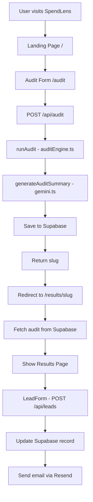

# Architecture

## System Diagram

## Data Flow

1. User fills AuditForm with tools, plans, spend, seats
2. Form POSTs to /api/audit
3. runAudit() evaluates each tool against pricingData
4. generateAuditSummary() calls Gemini API with audit results
5. Results saved to Supabase audits table with unique slug
6. User redirected to /results/[slug]
7. Results page fetches audit by slug from Supabase
8. User optionally submits email via LeadForm
9. /api/leads updates Supabase record and sends Resend email

## Stack

- **Framework:** Next.js 16 with App Router and TypeScript
- **Styling:** Tailwind CSS + shadcn/ui
- **Database:** Supabase (Postgres)
- **AI:** Google Gemini 1.5 Flash
- **Email:** Resend
- **Deploy:** Vercel
- **Testing:** Jest + ts-jest
- **CI:** GitHub Actions

## Why this stack

Next.js handles frontend and backend in one repo. Supabase gives us a real Postgres database with RLS security. Gemini is free. Resend has the best developer experience for transactional email. Vercel deploys Next.js perfectly with zero config.

## Scaling to 10k audits/day

- Add Redis caching for results pages (avoid repeat Supabase reads)
- Move audit processing to a queue (BullMQ) to handle spikes
- Add a CDN layer for the results pages (they are mostly static)
- Supabase connection pooling via PgBouncer (already built in)
- Rate limiting on /api/audit using Upstash Redis
